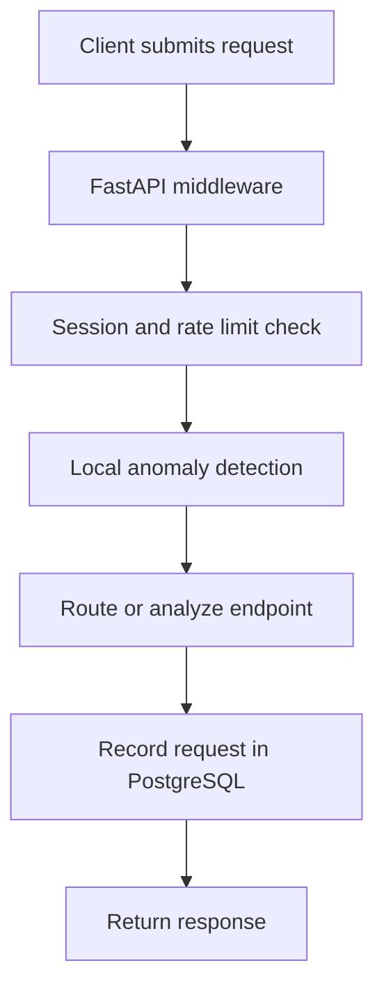
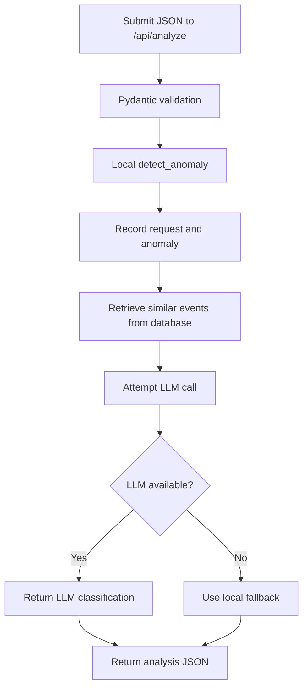
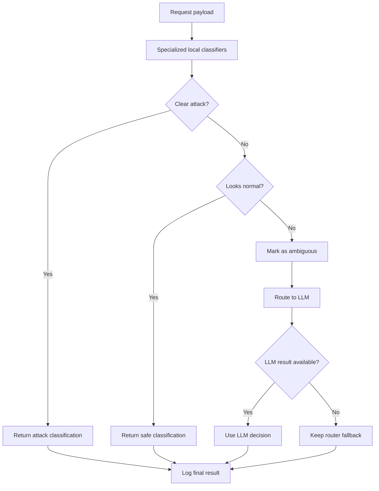

# Security Analysis Flow

## Baseline Flow



## Analyze Endpoint Flow



## Agentic Routing Upgrade Flow



## Demo Requests

### Normal Request

```json
{
  "path": "/login",
  "method": "POST",
  "payload": {
    "username": "student",
    "password": "normal-password"
  }
}
```

### SQL Injection Request

```json
{
  "path": "/login",
  "method": "POST",
  "payload": {
    "username": "admin' OR '1'='1",
    "password": "x"
  }
}
```

### Ambiguous LLM Review Request

```json
{
  "path": "/review",
  "method": "POST",
  "payload": {
    "message": "please review this admin token behavior"
  }
}
```
