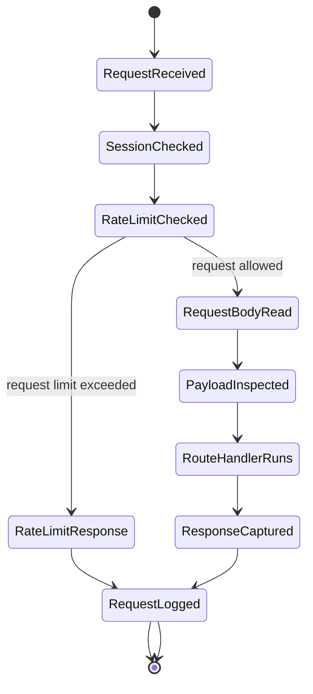
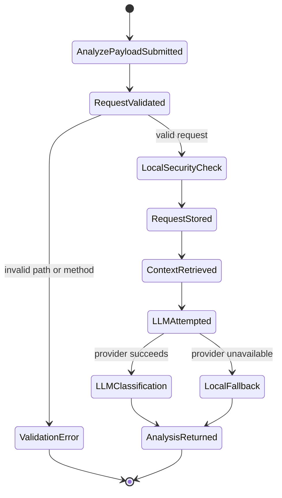
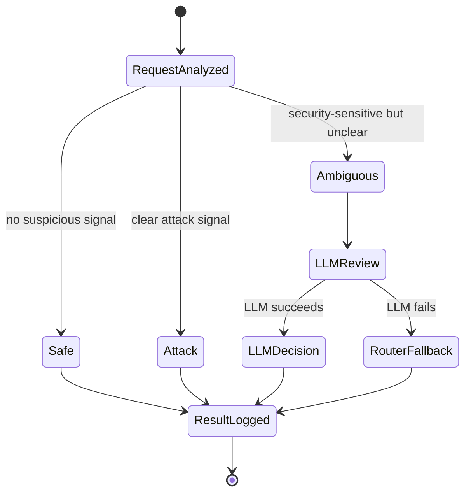

# Statechart Diagram

## Request Monitoring Statechart

This statechart shows how a request moves through the security monitoring system.

## Analyze Endpoint Statechart

## Agentic Routing Extension Statechart

