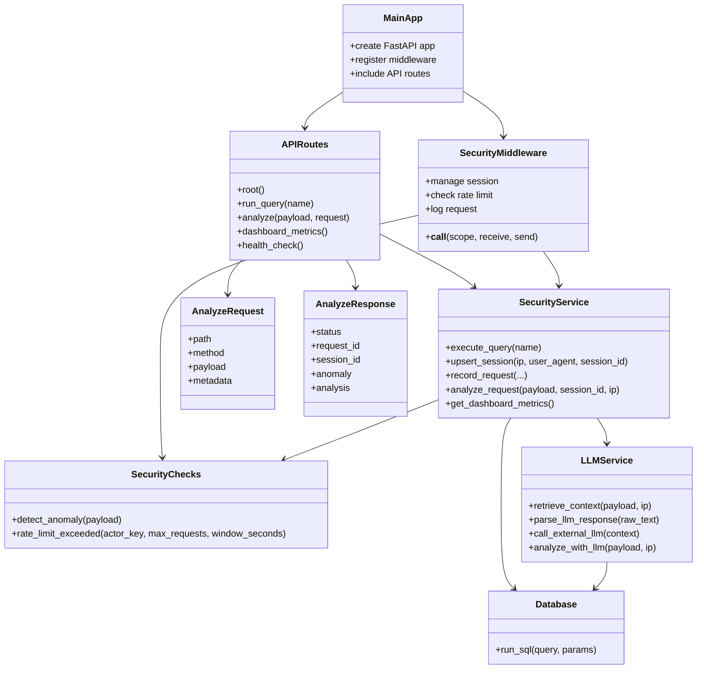

# UML Class Diagram

## Purpose

This diagram shows the main parts of the FastAPI security monitoring system and how they work together.

## Notes

- `APIRoutes` handles user/API interaction.
- `SecurityService` coordinates business logic and database writes.
- `SecurityChecks` performs local attack detection.
- `LLMService` adds optional contextual analysis.
- `Database` stores logs, sessions, and anomalies.
